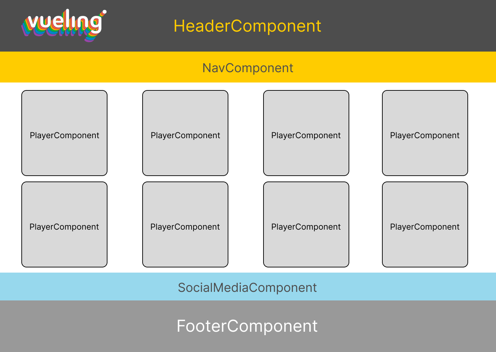
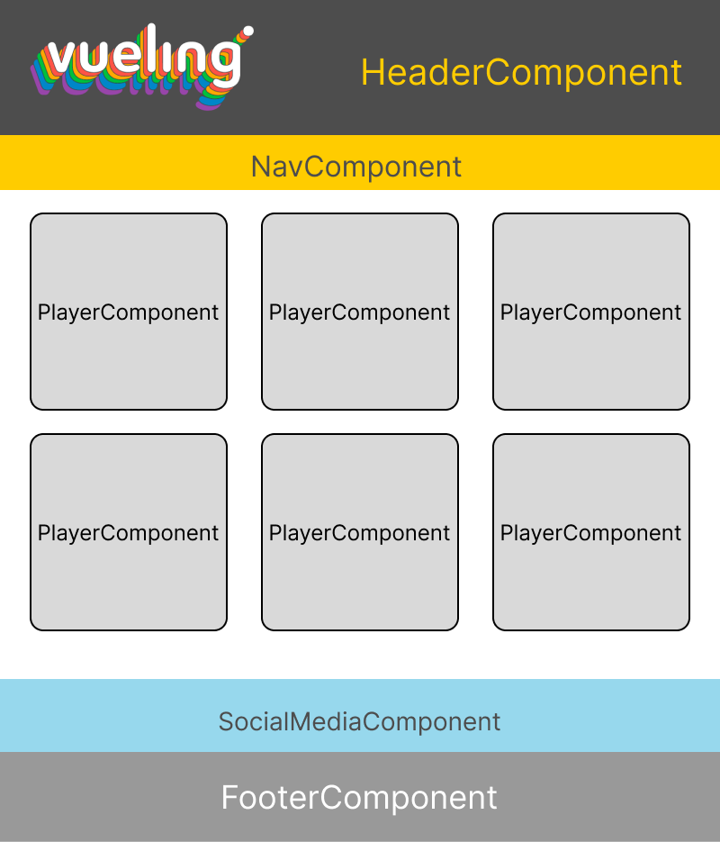
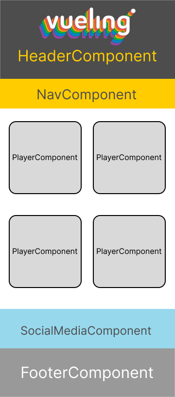

## Table of Contents

* [🐳 Heroku Deployment Via Docker](#demo)
* [📜 Bash Script to automatize Heroku's deployment Via Docker](#bash-script)
* [📖 S.O., NPM and NodeJS Versions](#some-versions)
* [📚 NPM Libraries used for this project](#npm-libraries)
* [🖼️ Previous Web Design](#previous-web-design)
* [🏗️ Project's scaffolding](#default-scaffolding)
* [📝 Checking if project is working](#check-proper-working)
* [🎨 SCSS styles: variables, mixins and fonts](#scss-styles)
* [🌐 Creating a multi-language site using ngx-translate library](#i18n-json-files)
* [🔎 ESLInt and Prettier Config](#eslint-and-prettier)
* [🅢🅞🅛🅘🅓 principles applied](#solid-principles-applied)
* [Other principles applied](#more-principles-applied)
* [🧱 Design pattern implemented on this project](#design-patterns-implemented)
* [📄 Modules implemented on this project](#modules-implemented)
* [🛡️ Guard implemented for the project](#guard-implemented)
* [Pipes used on this project](#pipes-made)
* [⏳ Lazy Loading Directive implemented](#lazy-loading-directive)
* [✋ Global http interceptor service for handling errors](#global-http-interceptor)
* [👁️ Observables on service for getting data from an API](#observables-for-getting-data)
* [<🆃> Abstract class with generic type](#class-with-generic-type)
* [📑✔️❌ Unit testing on the obtain-heroes service](#unit-testing)
* [Running unit tests](#running-unit-tests)
* [❓ Further Help](#further-help)

## Demo

<!-- Poner link que toque en el examen -->
[Ir a la demo](https://web-marvel.herokuapp.com/) 

## Bash Script

<!-- Cambiar nombre del repo en el link -->

In order to automatize the process of deployment to Heroku via Container Registry (Docker in this case),
I've created and bash script file called [dockerizeAppAngular.sh](https://github.com/gdsa1022/My-Custom-ANGULAR-Scafolding/blob/master/dockerizeAngularApp.sh).

Basically what this script does consist in:

    1. Assigning variables of image and Heroku's Server.
    2. Creating the nginx folder and downloading the default.conf file.
    3. Downloading the Dockerfile for Angular.
    4. Building the docker image.
    5. Installing Heroku if they'are not installed.
    6. Log in into Heroku.
    7. Log in on the heroku's container.
    8. Creating heroku's server if it don't exist.
    9. Putting tag on the image for the heroku's better understanding.
    10. Pushing it into heroku's docker container registry.
    11. Releasing the image into the heroku's web server.

For executing it, open a git bash terminal on the project's root folder and type ./dockerizeAppAngular.sh.

## Some Versions

* Windows 10 Enterprise (64-bit)
* Angular-CLi version 14.0.4
* NodeJS version 16.15.1
* NPM version 8.13.2

## NPM Libraries

<!-- Quitar o poner librerías si hiciera falta en el examen -->

* ngx-translate to perform a multi.language selector in header component.
* xng-breadcrumb (For showing the website's breadcrumbs in each )
* jsonwebtoken (For getting and managing the token on its JWT server).
* socket.io-client (For implementing the websockets functionalities on the website).

## Previous web Design

<!-- Cambiar los diseños genéricos -->

Before starting to develop the project, i've made a previous web design using the Figma software , which recreates the web interface using three max-widths (the desktop, the horizontal smartphone and the vertical smartphone one)and store the three exported images on [the designs folder](./designs).






## Default Scaffolding

This project was generated with a custom template that i made and uploaded into this [Github's public repo](https://github.com/gdsa1022/My-Custom-ANGULAR-Scafolding).


About the images above i just want to highlight that i've created the components, modules, pipes, services and styles folder inside the app one and also i've added inside the assets folder the i18n file for internazionalization and also the images folder for storing all the .svg, .png and jpg. files of the project.


## Check proper working
In order to ensure that the project is up and running properly on local, follow the steps:

1. Clone the project 'git clone pasteProjectURL' or Download its ZIP and extract it all.
2. Just type 'npm update' if it requires to have the latests libraries and dependencies versions. 
3. Type 'npm install' to load it all.
4. Finally, type 'ng serve -o' or 'ng build' for checking if the projects opens a local dev server and compiles the Angular app.

## SCSS styles

* [Colors.scss styles](#colors-file)
* [Mixins.scss styles](#mixins-file)
* [Tipography.scss styles](#tipography-file)
* [Global.scss styles](#global-file)


Firstable i've created the colors, mixins, tipography and global files inside the styles folder.


### Colors File

On the colors file I've applied the variables that i'll use more than once on the angular project by creating variables (which starts with $) and then applying the styles.

<!-- Poner código con colores del proyecto. Ahora pondré otro de otro proyecto -->
```scss
$blackMarvel: #151515;
$blackMarvel2: #202020; 
$redMarvel: #e62429;
$whiteMarvel: #FFFFFF;
$buttonsGrayMarvel: #657e88;
$footerHoverButtonsMarvel: #bbb;
$darkGrayMarvel: #767676;
$grayBorders: #393939;
```

### Mixins File

Moving on, on the mixins file i've created the following mixins:

1. allmedias mixin (which takes into account different device's max-widths using the map-get() method) 
2. flex mixin (which brings together most of the father container's flex properties)
3. grid mixin (which brings together most of the father container's grid properties)
4. transform mixin (which makes the transform property compatible for most of the web browsers).
5. box-model mixin (which makes the box-sizing property compatible for most of the web browsers).

```scss

$breakpoints: (
    phone-small: 425px,
    phone: 768px,
    tab-port: 1024px,
    tab-land: 1200px,
    footerFirstChange: 840px,
    footerSecondChange: 600px,
    footerThirdChange: 426px,
    tab-desktop: 1600px
);

@mixin allmedias($breakpoint) {
    @media screen and (max-width: map-get($breakpoints, $breakpoint)) {
        @content;
    }
}

@mixin transform($transforms) {
    -webkit-transform: $transforms;
    -moz-transform: $transforms;
    -ms-transform: $transforms;
    -o-transform: $transforms;
    transform: $transforms;
}

@mixin flex($disp, $direct, $corte, $justif, $alIt, $alCont) {
    display: $disp;
    flex-flow: $direct $corte;
    justify-content: $justif;
    align-items: $alIt;
    align-content: $alCont;
}

@mixin grid($dis, $filas, $columnas, $brechaFila, $brechaCol, $justIt, $justCont, $aliCont) {
    display: $dis;
    grid-template: repeat($filas, auto) / repeat($columnas, auto);
    grid-gap: $brechaFila $brechaCol;
    justify-items: $justIt;
    justify-content: $justCont;
    $align-content: $aliCont;
}

@mixin box-sizing($box-model) {
    -webkit-box-sizing: $box-model; // Safari <= 5
    -moz-box-sizing: $box-model; // Firefox <= 19
    -o-box-sizing: $box-model;
    box-sizing: $box-model;
}
```

### Tipography File

On the tipography file i've imported a google font and then creating a variable to assign its value.

```scss
@import url('https://fonts.googleapis.com/css2?family=Open+Sans&display=swap');

$mainFont: 'Open Sans', sans-serif;
```

### Global file

Finally, on the global file, i've put the imports of the previous three scss files and some properties to the * selector.

```scss
@import 'colors.scss';
@import 'mixins.scss';
@import 'tipography.scss';

*{
    margin: 0;
    padding: 0;
    text-decoration: none;
    box-sizing: content-box;
}
```

In order to show all those styles for all components, we have the put of @import of the global.scss once on the styles.scss.

## I18n JSON Files

In order to have had a multi-language site follow install all the packages from ngx-translate, create a service and communicate it with the controller on the component which will be located the multi-language selector (header, for example) and then create the JSON files (in out case 2), which they will follow a format similar to this ⬇️⬇️

<table>
<tr>
</tr>
<tr>
<td> ENG.JSON </td>
<td>

```json                                         
{                                                
    "translations": {                              
        "text1": "First text for the translations",   
        "text2": "Second text for the trasnslations", 
        "text3": "Third text for the translations"    
    }                                              
 }
```

</td>
</tr>
<tr>
<td> ES.JSON </td>
<td>

```json                                         
{                                                
    "translations": {                              
        "text1": "Primero texto para las traducciones",   
        "text2": "Segundo texto para las traducciones", 
        "text3": "Tercer texto para las traducciones"    
    }                                              
 }
```

</td>
</tr>
</table>

* On the view we can put the double interpolation with the ```{{jsonObject.jsonProperty | translate}}``` format.

## ESLint and Prettier

Along this code, i'm trying to follow the ESLint rules and Prettier configuration as much as possible.
IN order to enable and configure them, just by installing its Visual studio Code extensions [```dbaeumer.vscode-eslint``` & ```esbenp.prettier-vscode ```], installing the following dependencies:

```
npm install --save-dev eslint

npm install --save-dev @typescript-eslint/eslint-plugin eslint-plugin-prettier

npm install --save-dev prettier prettier-eslint eslint-config-prettier
```

And finally creating the [.eslintrc.json](https://raw.githubusercontent.com/gdsa1022/My-Custom-ANGULAR-Scafolding/master/.eslintrc.json), 
[.eslintignore](https://raw.githubusercontent.com/gdsa1022/My-Custom-ANGULAR-Scafolding/master/.eslintignore) and [.prettierrc.json](https://raw.githubusercontent.com/gdsa1022/My-Custom-ANGULAR-Scafolding/master/.prettierrc.json) files with the configuration that we want to apply to our project.

## SOLID Principles applied

- Single Repsonsability Principle on 'components.ts' and 'service.ts' files, creating one by one in order to perform an specific task.

- Dependency Injection Principles on some 'components.ts' when i instanciate as contrsuctor parameter the HttpClient and Router angular dependencies or even services that i've created (such as <!-- poner nombre del servicio -->).

- Interface segregation principle on models folder, just by creating interfaces on models folder with the necessary set of attributes and methods to pass to service and/or controller.

## More principles applied
Also in this project i tried to implement as much as possible the next principles. 

- K.I.S.S (Keep it simple, Stupid) 
- D.R.Y (Don't repeat yourself)
- Y.A.G.N.I (You're not gonna need it)

## Design patterns implemented

* MVC: Applied on all of the components located on 'components' folder which uses the interfaces located model 'models' folder.
* Pub-Sub: Applied on methods which implements the .subcribe() method, of the player-info controller by using the subscribe() method to retrieve the id passed as parameter of the URL on app-routing.module.ts
* Decorator Pattern: On the component.ts which implements the @input and @Output decorators for passing and sharing properties between parent and childs.
* Abstract Factory: Applied on resource.service.ts when i create the abstract class with generic types <T> on the 'services' folder.

## Modules implemented

For optimizing the project dependending if we are loading a module or a component, on the 'modules' folder we included and separated from app.module.ts these modules:

* material-stuff.module.ts (Included all the modules from Angular Material library)
* npm-libraries.module.ts (Included all the npm libraries used for this project)
* pipes_and_directives.module.ts (As the title says, it's included all the pipes and directives used for the project)

Example of the material-stuff-module.ts below:

```ts
import { NgModule } from '@angular/core';
import { CommonModule } from '@angular/common';

import {BrowserAnimationsModule} from '@angular/platform-browser/animations';
import {MatCheckboxModule} from '@angular/material/checkbox';
import {MatButtonModule} from '@angular/material/button';
import {MatInputModule} from '@angular/material/input';
import {MatAutocompleteModule} from '@angular/material/autocomplete';
import {MatDatepickerModule} from '@angular/material/datepicker';
import {MatFormFieldModule} from '@angular/material/form-field';
import {MatRadioModule} from '@angular/material/radio';
import {MatSelectModule} from '@angular/material/select';
import {MatSliderModule} from '@angular/material/slider';
import {MatSlideToggleModule} from '@angular/material/slide-toggle';
import {MatMenuModule} from '@angular/material/menu';
import {MatSidenavModule} from '@angular/material/sidenav';
import {MatToolbarModule} from '@angular/material/toolbar';
import {MatListModule} from '@angular/material/list';
import {MatGridListModule} from '@angular/material/grid-list';
import {MatCardModule} from '@angular/material/card';
import {MatStepperModule} from '@angular/material/stepper';
import {MatTabsModule} from '@angular/material/tabs';
import {MatExpansionModule} from '@angular/material/expansion';
import {MatButtonToggleModule} from '@angular/material/button-toggle';
import {MatChipsModule} from '@angular/material/chips';
import {MatIconModule} from '@angular/material/icon';
import {MatProgressSpinnerModule} from '@angular/material/progress-spinner';
import {MatProgressBarModule} from '@angular/material/progress-bar';
import {MatDialogModule} from '@angular/material/dialog';
import {MatTooltipModule} from '@angular/material/tooltip';
import {MatSnackBarModule} from '@angular/material/snack-bar';
import {MatTableModule} from '@angular/material/table';
import {MatSortModule} from '@angular/material/sort';
import {MatPaginatorModule} from '@angular/material/paginator';
import { FormsModule } from '@angular/forms';

@NgModule({
  declarations: [],
  imports: [
    CommonModule,
    BrowserAnimationsModule,
    MatCheckboxModule,
    MatCheckboxModule,
    MatButtonModule,
    MatInputModule,
    MatAutocompleteModule,
    MatDatepickerModule,
    MatFormFieldModule,
    MatRadioModule,
    MatSelectModule,
    MatSliderModule,
    MatSlideToggleModule,
    MatMenuModule,
    MatSidenavModule,
    MatToolbarModule,
    MatListModule,
    MatGridListModule,
    MatCardModule,
    MatStepperModule,
    MatTabsModule,
    MatExpansionModule,
    MatButtonToggleModule,
    MatChipsModule,
    MatIconModule,
    MatProgressSpinnerModule,
    MatProgressBarModule,
    MatDialogModule,
    MatTooltipModule,
    MatSnackBarModule,
    MatTableModule,
    MatSortModule,
    MatPaginatorModule,
    FormsModule
  ],
  exports: [
    CommonModule,
    BrowserAnimationsModule,
    MatCheckboxModule,
    MatCheckboxModule,
    MatButtonModule,
    MatInputModule,
    MatAutocompleteModule,
    MatDatepickerModule,
    MatFormFieldModule,
    MatRadioModule,
    MatSelectModule,
    MatSliderModule,
    MatSlideToggleModule,
    MatMenuModule,
    MatSidenavModule,
    MatToolbarModule,
    MatListModule,
    MatGridListModule,
    MatCardModule,
    MatStepperModule,
    MatTabsModule,
    MatExpansionModule,
    MatButtonToggleModule,
    MatChipsModule,
    MatIconModule,
    MatProgressSpinnerModule,
    MatProgressBarModule,
    MatDialogModule,
    MatTooltipModule,
    MatSnackBarModule,
    MatTableModule,
    MatSortModule,
    MatPaginatorModule,
    FormsModule
  ]
})
export class MaterialStuffModule { }
```

And finally, on app.module.ts will only remain all project's components.

## Guard implemented

In order to don't allow an access path if, for example, we don't have the credentials and token on localStorage, we implement a guard.
In this project the guard is of canActivate type and first we have to generate the guard via Angular-CLI ``` ng g guard guards/login ```, implement it and then it has to been declared on app-routing.module.ts on the following way:


```js
const routes: Routes = [
  { path: '', component: LoginComponent },
  {
    path: 'home',
    canActivate: [LoginGuardGuard],
    component: ContainerComponent
  }
];
```

## Pipes made

<!-- Poner más si uso más -->
1. A pipe for concatenating the parth and the extension of the superhero's thumbnail.


## Lazy-loading Directive
In order to load only the images that it'll show soon on window instead of all, it has implemented a lazy loading directive for the thumbnails for the superheroes.

After generating it with Angular-CLI command ```ng g d directives/lazyimgs```, next it has been implemented using the ElementRef
dependency to access to HTML Image element.

```js
import { Directive, ElementRef } from '@angular/core';

@Directive({
  selector: 'img'
})
export class LazyImgsDirective {

  constructor({nativeElement}:ElementRef<HTMLImageElement> ) 
  {
    const supports = 'loading' in HTMLImageElement.prototype;
    if(supports) nativeElement.setAttribute('loading', 'lazy');
  }

}
```


## Global HTTP interceptor

In order to able to get the http request and manage some possible errors that could appear, we create a service 
which intercept those and throw it to a more specific service or component that implements the HTTP request thourhg observables and subscription.

* Firstable we generate the service [``` ng g s services/global-http ```]
* Then on the service we import the CatchError, throwError, Observable and several Http dependencies defined below:

```js
import { Injectable } from '@angular/core';
import { catchError, Observable, throwError } from 'rxjs';
import { HttpEvent, HttpHandler, HttpErrorResponse, HttpRequest, HttpInterceptor } from '@angular/common/http';
```

* Inside the class, we made the intercept method to handle the request and add a pipe with catchError method, which basically will show the error through console and throw it:

```js
    intercept(req: HttpRequest<HttpErrorResponse>, next: HttpHandler):Observable<HttpEvent<HttpErrorResponse>>{
        return next.handle(req).pipe(
            catchError((error) => {
                console.log("Error is intercept");
                console.error(error);
                return throwError(() => error.message);
            })
        )
    }
```

## Observables for getting data

In this project has been implemented observables on the resource and the obtain-data services for detect any HTTP request made towards the API and also on the component which uses EventEmitter to show errors on the template.

## Class with generic type

For this project we implemented as a good practice to not repeat code for different services 
which could have same or similar methods, an abstract class with a generic type T.
On this project i used a generic type CRUD service, using the url of the APi as a string and passing the body of the request on the create and update method and the id on the delete method. 

<!-- Poner el còdigo de la clase génerica que sea -->

```js
import { Observable } from 'rxjs';
import { HttpClient } from '@angular/common/http';
import { Injectable } from '@angular/core';

@Injectable({
  providedIn: 'root'
})
export abstract class AbstractHttpCallsService<T> {
  protected abstract apiUrl: string;
  constructor(protected http: HttpClient) {}

  getList(): Observable<T[]> {
    return this.http.get<T[]>(`${this.apiUrl}`);
  }

  getSinglebyID(id:number | string): Observable<T> {
    return this.http.get<T>(`${this.apiUrl}/${id}`);
  }
}
```
## Unit testing
For this project it has been implemented a unit on the get heroes service in order to check 
if the API data given was received correctly.


After imported all the necessary dependencies and models created, inside the describe() method 
it has been mocked an array who emulates the format and types of data received from the API.

```ts
let arrayHeroes:IHero[] = [
      {id: 1, name: "batman", thumbnail: "path.extension"},
      {id: 2, name: "superman", thumbnail: "path.extension"},
      {id: 3, name: "namor", thumbnail: "path.extension"}
  ];
```

And then we write to it(), one for receiving all the data from the API
and another to check if it received one hero for its id.

```ts
it('should call getHeroes and return a list of heroes', () => {
			
			// 1
		  service.getHeroes().subscribe((res) => {
				//2
	      expect(res.length).toBeGreaterThan(0);
	    });
	
			//3
	    const req = httpController.expectOne({
	      method: 'GET',
	      url: `${url}${params}`,
	    });

			//4
	    req.flush(arrayHeroes);

	  });

it('should call getHeroById and return the hero selected by its id', () => {

    const addedStudent2: IHero = {
      id: 5,
      name: 'Dr MAnhattan',
      thumbnail: 'path.extension',
    };

        service.getHeroById(addedHero.id).subscribe((res) => {
            //2
    expect(res).toEqual(addedHero);
    });        

    const req = httpController.expectOne({
        method: 'GET',
        url: `${url}${addedHero.id}`,
    });

    req.flush(addedHero);
  });
``` 

## Running unit tests

Run `ng test` to execute the unit tests via [Karma](https://karma-runner.github.io).

## Further help

If you have some doubts, don't hesitate to contact me through my e-mail heimricusdc@gmail.com 
or in my [LinkedIn profile](https://www.linkedin.com/in/ericd%C3%ADazc%C3%ADvico/)instead.