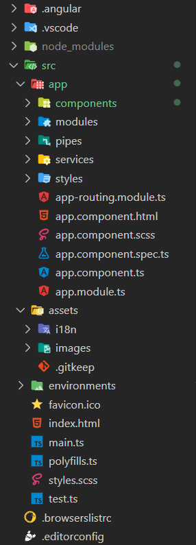
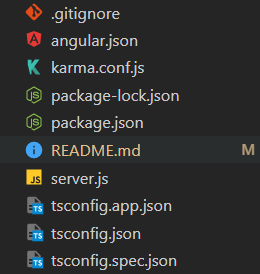
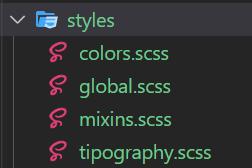

## Table of Contents

* [🐳 Heroku Deployment Via Docker](#demo)
* [📜 Bash Script to automatize Heroku's deployment Via Docker](#bash-script)
* [📖 S.O., NPM and NodeJS Versions](#some-versions)
* [📚 NPM Libraries used for this project](#npm-libraries)
* [🏗️ Project's scaffolding](#default-scaffolding)
* [📝 Checking if project is working](#check-proper-working)
* [🎨 SCSS styles: variables, mixins and fonts](#scss-styles)
* [🌐 Creating a multi-language site using ngx-translate library](#i18n-json-files)
* [🔎 ESLInt and Prettier Config](#eslint-and-prettier)

## Demo

<!-- Poner link que toque en el examen -->
[Ir a la demo](https://web-marvel.herokuapp.com/) 

## Bash Script

<!-- Cambiar nombre del repo en el link -->

In order to automatize the process of deployment to Heroku via Container Registry (Docker in this case),
I've created and bash script file called [dockerizeAppAngular.sh](https://github.com/gdsa1022/My-Custom-ANGULAR-Scafolding/blob/master/dockerizeAngularApp.sh).

Basically what this script does consist in:

    1. Assigning variables of image and Heroku's Server.
    2. Creating the nginx folder and downloading the default.conf file.
    3. Downloading the Dockerfile for Angular.
    4. Building the docker image.
    5. Installing Heroku if they'are not installed.
    6. Log in into Heroku.
    7. Log in on the heroku's container.
    8. Creating heroku's server if it don't exist.
    9. Putting tag on the image for the heroku's better understanding.
    10. Pushing it into heroku's docker container registry.
    11. Releasing the image into the heroku's web server.

For executing it, open a git bash terminal on the project's root folder and type ./dockerizeAppAngular.sh.

## Some Versions

* Windows 10 Enterprise (64-bit)
* Angular-CLi version 14.0.4
* NodeJS version 16.15.1
* NPM version 8.13.2

## NPM Libraries

<!-- Quitar o poner librerías si hiciera falta en el examen -->

* ngx-translate to perform a multi.language selector in header component.
* xng-breadcrumb (For showing the website's breadcrumbs in each )
* jsonwebtoken (For getting and managing the token on its JWT server).
* socket.io-client (For implementing the websockets functionalities on the website).

## Default Scaffolding
This project was generated with a custom template that i made and uploaded into this [Github's public repo](https://github.com/gdsa1022/My-Custom-ANGULAR-Scafolding).




About the images above i just want to highlight that i've created the components, modules, pipes, services and styles folder inside the app one and also i've added inside the assets folder the i18n file for internazionalization and also the images folder for storing all the .svg, .png and jpg. files of the project.


## Check proper working
In order to ensure that the project is up and running properly on local, follow the steps:

1. Clone the project 'git clone pasteProjectURL' or Download its ZIP and extract it all.
2. Just type 'npm update' if it requires to have the latests libraries and dependencies versions. 
3. Type 'npm install' to load it all.
4. Finally, type 'ng serve -o' or 'ng build' for checking if the projects opens a local dev server and compiles the Angular app.

## SCSS styles

* [Colors.scss styles](#colors-file)
* [Mixins.scss styles](#mixins-file)
* [Tipography.scss styles](#tipography-file)
* [Global.scss styles](#global-file)


Firstable i've created the colors, mixins, tipography and global files inside the styles folder.



### Colors File

On the colors file I've applied the variables that i'll use more than once on the angular project by creating variables (which starts with $) and then applying the styles.

<!-- Poner código con colores del proyecto. Ahora pondré otro de otro proyecto -->
```scss
$blackMarvel: #151515;
$blackMarvel2: #202020; 
$redMarvel: #e62429;
$whiteMarvel: #FFFFFF;
$buttonsGrayMarvel: #657e88;
$footerHoverButtonsMarvel: #bbb;
$darkGrayMarvel: #767676;
$grayBorders: #393939;
```

### Mixins File

Moving on, on the mixins file i've created the following mixins:

1. allmedias mixin (which takes into account different device's max-widths using the map-get() method) 
2. flex mixin (which brings together most of the father container's flex properties)
3. grid mixin (which brings together most of the father container's grid properties)
4. transform mixin (which makes the transform property compatible for most of the web browsers).
5. box-model mixin (which makes the box-sizing property compatible for most of the web browsers).

```scss

$breakpoints: (
    phone-small: 425px,
    phone: 768px,
    tab-port: 1024px,
    tab-land: 1200px,
    footerFirstChange: 840px,
    footerSecondChange: 600px,
    footerThirdChange: 426px,
    tab-desktop: 1600px
);

@mixin allmedias($breakpoint) {
    @media screen and (max-width: map-get($breakpoints, $breakpoint)) {
        @content;
    }
}

@mixin transform($transforms) {
    -webkit-transform: $transforms;
    -moz-transform: $transforms;
    -ms-transform: $transforms;
    -o-transform: $transforms;
    transform: $transforms;
}

@mixin flex($disp, $direct, $corte, $justif, $alIt, $alCont) {
    display: $disp;
    flex-flow: $direct $corte;
    justify-content: $justif;
    align-items: $alIt;
    align-content: $alCont;
}

@mixin grid($dis, $filas, $columnas, $brechaFila, $brechaCol, $justIt, $justCont, $aliCont) {
    display: $dis;
    grid-template: repeat($filas, auto) / repeat($columnas, auto);
    grid-gap: $brechaFila $brechaCol;
    justify-items: $justIt;
    justify-content: $justCont;
    $align-content: $aliCont;
}

@mixin box-sizing($box-model) {
    -webkit-box-sizing: $box-model; // Safari <= 5
    -moz-box-sizing: $box-model; // Firefox <= 19
    -o-box-sizing: $box-model;
    box-sizing: $box-model;
}
```

### Tipography File

On the tipography file i've imported a google font and then creating a variable to assign its value.

```scss
@import url('https://fonts.googleapis.com/css2?family=Open+Sans&display=swap');

$mainFont: 'Open Sans', sans-serif;
```

### Global file

Finally, on the global file, i've put the imports of the previous three scss files and some properties to the * selector.

```scss
@import 'colors.scss';
@import 'mixins.scss';
@import 'tipography.scss';

*{
    margin: 0;
    padding: 0;
    text-decoration: none;
    box-sizing: content-box;
}
```

In order to show all those styles for all components, we have the put of @import of the global.scss once on the styles.scss.

## I18n JSON Files

In order to have had a multi-language site follow install all the packages from ngx-translate, create a service and communicate it with the controller on the component which will be located the multi-language selector (header, for example) and then create the JSON files (in out case 2), which they will follow a format similar to this ⬇️⬇️

<table>
<tr>
</tr>
<tr>
<td> ENG.JSON </td>
<td>

```json                                         
{                                                
    "translations": {                              
        "text1": "First text for the translations",   
        "text2": "Second text for the trasnslations", 
        "text3": "Third text for the translations"    
    }                                              
 }
```

</td>
</tr>
<tr>
<td> ES.JSON </td>
<td>

```json                                         
{                                                
    "translations": {                              
        "text1": "Primero texto para las traducciones",   
        "text2": "Segundo texto para las traducciones", 
        "text3": "Tercer texto para las traducciones"    
    }                                              
 }
```

</td>
</tr>
</table>

* On the view we can put the double interpolation with the ```{{jsonObject.jsonProperty | translate}}``` format.

## ESLint and Prettier

## Build

Run `ng build` to build the project. The build artifacts will be stored in the `dist/` directory.

## Running unit tests

Run `ng test` to execute the unit tests via [Karma](https://karma-runner.github.io).

## Running end-to-end tests

Run `ng e2e` to execute the end-to-end tests via a platform of your choice. To use this command, you need to first add a package that implements end-to-end testing capabilities.

## Further help

To get more help on the Angular CLI use `ng help` or go check out the [Angular CLI Overview and Command Reference](https://angular.io/cli) page.
